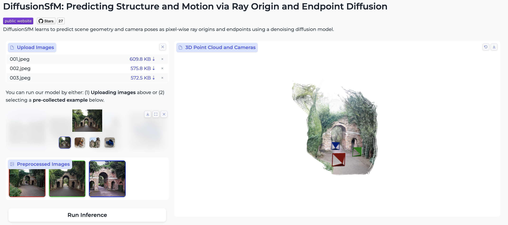

# DiffusionSfM

This repository contains the official implementation for **DiffusionSfM: Predicting Structure and Motion**
**via Ray Origin and Endpoint Diffusion**. The paper has been accepted to [CVPR 2025](https://cvpr.thecvf.com/Conferences/2025).

[Project Page](https://qitaozhao.github.io/DiffusionSfM) | [arXiv](https://arxiv.org/abs/2505.05473) | <a href='https://huggingface.co/spaces/qitaoz/DiffusionSfM'></a>

### News

- 2025.05.04: Initial code release.

## Introduction

**tl;dr** Given a set of multi-view images, **DiffusionSfM** represents scene geometry and cameras as pixel-wise ray origins and endpoints in a global frame. It learns a denoising diffusion model to infer these elements directly from multi-view inputs.


## Install

1. Clone DiffusionSfM:

```bash
git clone https://github.com/QitaoZhao/DiffusionSfM.git
cd DiffusionSfM
```

2. Create the environment and install packages:

```bash
conda create -n diffusionsfm python=3.9
conda activate diffusionsfm

# enable nvcc
conda install -c conda-forge cudatoolkit-dev

### torch
# CUDA 11.7
conda install pytorch==2.0.1 torchvision==0.15.2 torchaudio==2.0.2 pytorch-cuda=11.7 -c pytorch -c nvidia

pip install -r requirements.txt

### pytorch3D
# CUDA 11.7
conda install https://anaconda.org/pytorch3d/pytorch3d/0.7.7/download/linux-64/pytorch3d-0.7.7-py39_cu117_pyt201.tar.bz2

# xformers
conda install xformers -c xformers
```

Tested on:

- Springdale Linux 8.6 with torch 2.0.1 & CUDA 11.7 on A6000 GPUs.

> **Note:** If you encounter the error

> ImportError: .../libtorch_cpu.so: undefined symbol: iJIT_NotifyEvent

> when importing PyTorch, refer to this [related issue](https://github.com/coleygroup/shepherd-score/issues/1) or try installing Intel MKL explicitly with:

```
conda install mkl==2024.0  
```

## Run Demo

#### (1) Try the Online Demo

Check out our interactive demo on Hugging Face:  

👉 [DiffusionSfM Demo](https://huggingface.co/spaces/qitaoz/DiffusionSfM)

#### (2) Run the Gradio Demo Locally

Download the model weights manually from [Google Drive](https://drive.google.com/file/d/1NBdq7A1QMFGhIbpK1HT3ATv2S1jXWr2h/view?usp=drive_link), or run the following commands:

```
gdown https://drive.google.com/uc\?id\=1NBdq7A1QMFGhIbpK1HT3ATv2S1jXWr2h
unzip models.zip

# first-time running may take a longer time
python gradio_app.py
```



You can run our model in two ways:

1. **Upload Images** — Upload your own multi-view images above.
2. **Use a Preprocessed Example** — Select one of the pre-collected examples below.

## Training

Set up wandb:

```bash
wandb login
```

See [docs/train.md](https://github.com/QitaoZhao/DiffusionSfM/blob/main/docs/train.md) for more detailed instructions on training.

## Evaluation

See [docs/eval.md](https://github.com/QitaoZhao/DiffusionSfM/blob/main/docs/eval.md) for instructions on how to run evaluation code.

## Acknowledgments

This project builds upon [RayDiffusion](https://github.com/jasonyzhang/RayDiffusion). [Amy Lin](https://amyxlase.github.io/) and [Jason Y. Zhang](https://jasonyzhang.com/) developed the initial codebase during the early stages of this project.

## Cite DiffusionSfM

If you find this code helpful, please cite:

```
@inproceedings{zhao2025diffusionsfm,
  title={DiffusionSfM: Predicting Structure and Motion via Ray Origin and Endpoint Diffusion}, 
  author={Qitao Zhao and Amy Lin and Jeff Tan and Jason Y. Zhang and Deva Ramanan and Shubham Tulsiani},
  booktitle={CVPR},
  year={2025}
}
```